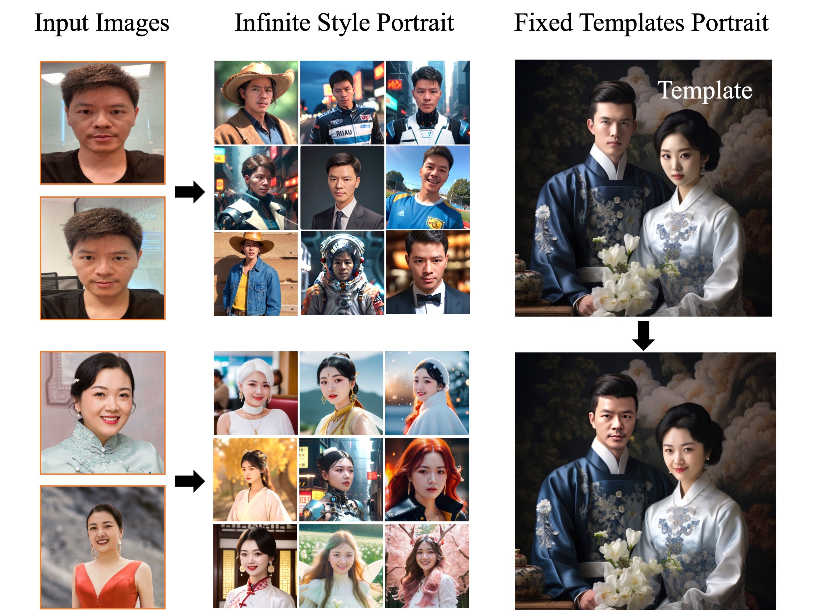
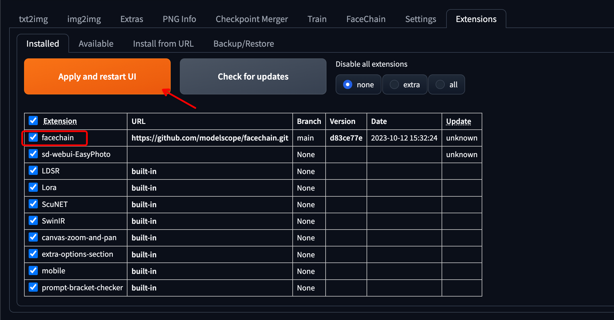
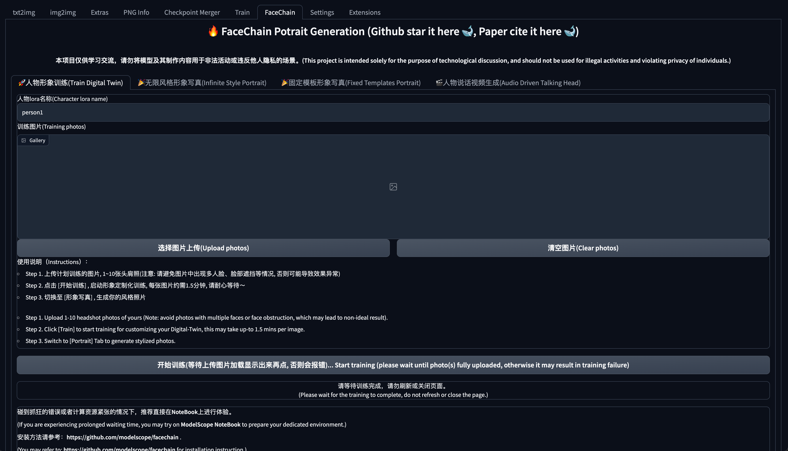

<p align="center">
    <br>
    
    <br>
    <h1>FaceChain</h1>
<p>

# Breaking News

Our work [InfoBatch](https://github.com/henryqin1997/InfoBatch) co-authored with NUS team got accepted to ICLR 2024(Oral)! A new version with only 3 lines of change will be updated soon.

# Introduction

如果您熟悉中文，可以阅读[中文版本的README](./README_ZH.md)。

FaceChain is a deep-learning toolchain for generating your Digital-Twin. With a minimum of 1 portrait-photo, you can create a Digital-Twin of your own and start generating personal portraits in different settings (multiple styles now supported!). You may train your Digital-Twin model and generate photos via FaceChain's Python scripts, or via the familiar Gradio interface, or via sd webui.
FaceChain is powered by [ModelScope](https://github.com/modelscope/modelscope).


<p align="center">
        ModelScope Studio <a href="https://modelscope.cn/studios/CVstudio/cv_human_portrait/summary">🤖<a></a>&nbsp ｜API <a href="https://help.aliyun.com/zh/dashscope/developer-reference/facechain-quick-start">🔥<a></a>&nbsp ｜ API's Example App <a href="https://tongyi.aliyun.com/wanxiang/app/portrait-gallery">🔥<a></a>&nbsp | SD WebUI ｜ HuggingFace Space <a href="https://huggingface.co/spaces/modelscope/FaceChain">🤗</a>&nbsp 
</p>
<br>





# News
- Our work [InfoBatch](https://github.com/henryqin1997/InfoBatch) co-authored with NUS team got accepted to ICLR 2024(Oral)! (January 16th, 2024 UTC)
- 🏆OpenAtom's 2023 Rapidly Growing Open Source Projects Award. (December 20th, 2023 UTC)
- Add SDXL pipeline🔥🔥🔥, image detail is improved obviously. (November 22th, 2023 UTC)
- Support super resolution🔥🔥🔥, provide multiple resolution choice (512*512, 768*768, 1024*1024, 2048*2048). (November 13th, 2023 UTC)
- 🏆FaceChain has been selected in the [BenchCouncil Open100 (2022-2023)](https://www.benchcouncil.org/evaluation/opencs/annual.html#Institutions) annual ranking. (November 8th, 2023 UTC)
- Add virtual try-on module. (October 27th, 2023 UTC)
- Add wanx version [online free app](https://tongyi.aliyun.com/wanxiang/app/portrait-gallery). (October 26th, 2023 UTC)
- 🏆1024 Programmer's Day AIGC Application Tool Most Valuable Business Award. (2023-10-24, 2023 UTC)
- Support FaceChain in stable-diffusion-webui🔥🔥🔥. (October 13th, 2023 UTC)
- High performance inpainting for single & double person, Simplify User Interface. (September 09th, 2023 UTC)
- More Technology Details can be seen in [Paper](https://arxiv.org/abs/2308.14256). (August 30th, 2023 UTC)
- Add validate & ensemble for Lora training, and InpaintTab(hide in gradio for now).  (August 28th, 2023 UTC)
- Add pose control module.   (August 27th, 2023 UTC)
- Add robust face lora training module, enhance the performance of one pic training & style-lora blending.   (August 27th, 2023 UTC)
- HuggingFace Space is available now! You can experience FaceChain directly with <a href="https://huggingface.co/spaces/modelscope/FaceChain">🤗</a>      (August 25th, 2023 UTC)
- Add awesome prompts! Refer to: [awesome-prompts-facechain](resources/awesome-prompts-facechain.txt)   (August 18th, 2023 UTC)
- Support a series of new style models in a plug-and-play fashion.  (August 16th, 2023 UTC)
- Support customizable prompts. (August 16th, 2023 UTC)
- Colab notebook is available now! You can experience FaceChain directly with  [](https://colab.research.google.com/github/modelscope/facechain/blob/main/facechain_demo.ipynb).   (August 15th, 2023 UTC)


# To-Do List
- Develop train-free methods, make it possible to run on cpu.
- Develop RLHF methods, make its quality more higher.
- Provide training scripts for new style lora.
- Support more style lora (such as those on Civitai).
- Support more beauty-retouch effects.
- Provide more funny apps.


# Citation

Please cite FaceChain in your publications if it helps your research
```
@article{liu2023facechain,
  title={FaceChain: A Playground for Identity-Preserving Portrait Generation},
  author={Liu, Yang and Yu, Cheng and Shang, Lei and Wu, Ziheng and 
          Wang, Xingjun and Zhao, Yuze and Zhu, Lin and Cheng, Chen and 
          Chen, Weitao and Xu, Chao and Xie, Haoyu and Yao, Yuan and 
          Zhou,  Wenmeng and Chen Yingda and Xie, Xuansong and Sun, Baigui},
  journal={arXiv preprint arXiv:2308.14256},
  year={2023}
}
```


# Installation

## Compatibility Verification
We have verified e2e execution on the following environment:
- python: py3.8, py3.10
- pytorch: torch2.0.0, torch2.0.1
- CUDA: 11.7
- CUDNN: 8+
- OS: Ubuntu 20.04, CentOS 7.9
- GPU: Nvidia-A10 24G

## Resource Requirement
- GPU: About 19G
- Disk: About 50GB

## Installation Guide
The following installation methods are supported:


### 1. ModelScope notebook【recommended】

   The ModelScope Notebook offers a free-tier that allows ModelScope user to run the FaceChain application with minimum setup, refer to [ModelScope Notebook](https://modelscope.cn/my/mynotebook/preset)

```shell
# Step1: 我的notebook -> PAI-DSW -> GPU环境
# Note: Please use: ubuntu22.04-cuda11.8.0-py310-torch2.1.0-tf2.14.0-1.10.0

# Step2: Entry the Notebook cell，clone FaceChain from github:
!GIT_LFS_SKIP_SMUDGE=1 git clone https://github.com/modelscope/facechain.git --depth 1

# Step3: Change the working directory to facechain, and install the dependencies:
import os
os.chdir('/mnt/workspace/facechain')    # You may change to your own path
print(os.getcwd())

!pip3 install gradio==3.50.2
!pip3 install controlnet_aux==0.0.6
!pip3 install python-slugify
!pip3 install onnxruntime==1.15.1
!pip3 install edge-tts
!pip3 install modelscope==1.10.0

# Step4: Start the app service, click "public URL" or "local URL", upload your images to 
# train your own model and then generate your digital twin.
!python3 app.py

```
   Alternatively, you may also purchase a [PAI-DSW](https://www.aliyun.com/activity/bigdata/pai/dsw) instance (using A10 resource), with the option of ModelScope image to run FaceChain following similar steps.


### 2. Docker

If you are familiar with using docker, we recommend to use this way:

```shell
# Step1: Prepare the environment with GPU on local or cloud, we recommend to use Alibaba Cloud ECS, refer to: https://www.aliyun.com/product/ecs

# Step2: Download the docker image (for installing docker engine, refer to https://docs.docker.com/engine/install/）
# For China Mainland users:
docker pull registry.cn-hangzhou.aliyuncs.com/modelscope-repo/modelscope:ubuntu20.04-cuda11.8.0-py38-torch2.0.1-tf2.13.0-1.9.4
# For users outside China Mainland:
docker pull registry.us-west-1.aliyuncs.com/modelscope-repo/modelscope:ubuntu20.04-cuda11.8.0-py38-torch2.0.1-tf2.13.0-1.9.4

# Step3: run the docker container
docker run -it --name facechain -p 7860:7860 --gpus all registry.cn-hangzhou.aliyuncs.com/modelscope-repo/modelscope:ubuntu20.04-cuda11.8.0-py38-torch2.0.1-tf2.13.0-1.9.4 /bin/bash
# Note: you may need to install the nvidia-container-runtime, follow the instructions:
# 1. Install nvidia-container-runtime：https://docs.nvidia.com/datacenter/cloud-native/container-toolkit/latest/install-guide.html
# 2. sudo systemctl restart docker

# Step4: Install the gradio in the docker container:
pip3 install gradio==3.50.2
pip3 install controlnet_aux==0.0.6
pip3 install python-slugify
pip3 install onnxruntime==1.15.1
pip3 install edge-tts
pip3 install modelscope==1.10.0

# Step5 clone facechain from github
GIT_LFS_SKIP_SMUDGE=1 git clone https://github.com/modelscope/facechain.git --depth 1
cd facechain
python3 app.py
# Note: FaceChain currently assume single-GPU, if your environment has multiple GPU, please use the following instead:
# CUDA_VISIBLE_DEVICES=0 python3 app.py

# Step6
Run the app server: click "public URL" --> in the form of: https://xxx.gradio.live
```

### 3. Conda Virtual Environment

Use the conda virtual environment, and refer to [Anaconda](https://docs.anaconda.com/anaconda/install/) to manage your dependencies. After installation, execute the following commands:
(Note: mmcv has strict environment requirements and might not be compatible in some cases. It's recommended to use Docker.)

```shell
conda create -n facechain python=3.8    # Verified environments: 3.8 and 3.10
conda activate facechain

GIT_LFS_SKIP_SMUDGE=1 git clone https://github.com/modelscope/facechain.git --depth 1
cd facechain

pip3 install -r requirements.txt
pip3 install -U openmim 
mim install mmcv-full==1.7.0

# Navigate to the facechain directory and run:
python3 app.py
# Note: FaceChain currently assume single-GPU, if your environment has multiple GPU, please use the following instead:
# CUDA_VISIBLE_DEVICES=0 python3 app.py

# Finally, click on the URL generated in the log to access the web page.
```

**Note**: After the app service is successfully launched, go to the URL in the log, enter the "Image Customization" tab, click "Select Image to Upload", and choose at least one image with a face. Then, click "Start Training" to begin model training. After the training is completed, there will be corresponding displays in the log. Afterwards, switch to the "Image Experience" tab and click "Start Inference" to generate your own digital image.

*Note* For windows user, you should pay attention to following steps:
```shell
install mmcv-full by pip: pip3 install mmcv-full
```

**If you want to use the `Audio Driven Talking Head` tab, please refer to the installation guide in [installation_for_talkinghead](doc/installation_for_talkinghead.md).**

### 4. Colab notebook

| Colab | Info
| --- | --- |
[](https://colab.research.google.com/github/modelscope/facechain/blob/main/facechain_demo.ipynb) | FaceChain Installation on Colab

### 5. stable-diffusion-webui
1. Select the `Extensions Tab`, then choose `Install From URL` (official plugin integration is u).
   

2. Switch to `Installed`, check the FaceChain plugin, then click `Apply and restart UI`.
   

3. After the page refreshes, the appearance of the `FaceChain` Tab indicates a successful installation.
   


# Script Execution

FaceChain supports direct training and inference in the python environment. Run the following command in the cloned folder to start training:

```shell
PYTHONPATH=. sh train_lora.sh "ly261666/cv_portrait_model" "v2.0" "film/film" "./imgs" "./processed" "./output"
```

Parameters description:

```text
ly261666/cv_portrait_model: The stable diffusion base model of the ModelScope model hub, which will be used for training, no need to be changed.
v2.0: The version number of this base model, no need to be changed
film/film: This base model may contains multiple subdirectories of different styles, currently we use film/film, no need to be changed
./imgs: This parameter needs to be replaced with the actual value. It means a local file directory that contains the original photos used for training and generation
./processed: The folder of the processed images after preprocessing, this parameter needs to be passed the same value in inference, no need to be changed
./output: The folder where the model weights stored after training, no need to be changed
```

Wait for 5-20 minutes to complete the training. Users can also adjust other training hyperparameters. The hyperparameters supported by training can be viewed in the file of `train_lora.sh`, or the complete hyperparameter list in `facechain/train_text_to_image_lora.py`.

When inferring, please edit the code in run_inference.py:

```python
# Use depth control, default False, only effective when using pose control
use_depth_control = False
# Use pose control, default False
use_pose_model = False
# The path of the image for pose control, only effective when using pose control
pose_image = 'poses/man/pose1.png'
# Fill in the folder of the images after preprocessing above, it should be the same as during training
processed_dir = './processed'
# The number of images to generate in inference
num_generate = 5
# The stable diffusion base model used in training, no need to be changed
base_model = 'ly261666/cv_portrait_model'
# The version number of this base model, no need to be changed
revision = 'v2.0'
# This base model may contains multiple subdirectories of different styles, currently we use film/film, no need to be changed
base_model_sub_dir = 'film/film'
# The folder where the model weights stored after training, it must be the same as during training
train_output_dir = './output'
# Specify a folder to save the generated images, this parameter can be modified as needed
output_dir = './generated'
# Use Chinese style model, default False
use_style = False
```

Then execute:

```shell
python run_inference.py
```

You can find the generated personal digital image photos in the `output_dir`.

# Algorithm Introduction

## Architectural Overview

The ability of the personal portrait generation evolves around the text-to-image capability of Stable Diffusion model. We consider the main factors that affect the generation effect of personal portraits: portrait style information and user character information. For this, we use the style LoRA model trained offline and the face LoRA model trained online to learn the above information. LoRA is a fine-tuning model with fewer trainable parameters. In Stable Diffusion, the information of the input image can be injected into the LoRA model by the way of text generation image training with a small amount of input image. Therefore, the ability of the personal portrait model is divided into training and inference stages. The training stage generates image and text label data for fine-tuning the Stable Diffusion model, and obtains the face LoRA model. The inference stage generates personal portrait images based on the face LoRA model and style LoRA model.


## Training

Input: User-uploaded images that contain clear face areas

Output: Face LoRA model

Description: First, we process the user-uploaded images using an image rotation model based on orientation judgment and a face refinement rotation method based on face detection and keypoint models, and obtain images containing forward faces. Next, we use a human body parsing model and a human portrait beautification model to obtain high-quality face training images. Afterwards, we use a face attribute model and a text annotation model, combined with tag post-processing methods, to generate fine-grained labels for training images. Finally, we use the above images and label data to fine-tune the Stable Diffusion model to obtain the face LoRA model.

## Inference

Input: User-uploaded images in the training phase, preset input prompt words for generating personal portraits

Output: Personal portrait image

Description: First, we fuse the weights of the face LoRA model and style LoRA model into the Stable Diffusion model. Next, we use the text generation image function of the Stable Diffusion model to preliminarily generate personal portrait images based on the preset input prompt words. Then we further improve the face details of the above portrait image using the face fusion model. The template face used for fusion is selected from the training images through the face quality evaluation model. Finally, we use the face recognition model to calculate the similarity between the generated portrait image and the template face, and use this to sort the portrait images, and output the personal portrait image that ranks first as the final output result.

## Model List

The models used in FaceChain:

[1]  Face detection model DamoFD：https://modelscope.cn/models/damo/cv_ddsar_face-detection_iclr23-damofd

[2]  Image rotating model, offered in the ModelScope studio

[3]  Human parsing model M2FP：https://modelscope.cn/models/damo/cv_resnet101_image-multiple-human-parsing

[4]  Skin retouching model ABPN：https://www.modelscope.cn/models/damo/cv_unet_skin_retouching_torch

[5]  Face attribute recognition model FairFace：https://modelscope.cn/models/damo/cv_resnet34_face-attribute-recognition_fairface

[6]  DeepDanbooru model：https://github.com/KichangKim/DeepDanbooru

[7]  Face quality assessment FQA：https://modelscope.cn/models/damo/cv_manual_face-quality-assessment_fqa

[8]  Face fusion model：https://www.modelscope.cn/models/damo/cv_unet_face_fusion_torch

[9]  Face recognition model RTS：https://modelscope.cn/models/damo/cv_ir_face-recognition-ood_rts     

[10] Talking head model：https://modelscope.cn/models/wwd123/sadtalker

# More Information

- [ModelScope library](https://github.com/modelscope/modelscope/)


​		ModelScope Library provides the foundation for building the model-ecosystem of ModelScope, including the interface and implementation to integrate various models into ModelScope. 

- [Contribute models to ModelScope](https://modelscope.cn/docs/ModelScope%E6%A8%A1%E5%9E%8B%E6%8E%A5%E5%85%A5%E6%B5%81%E7%A8%8B%E6%A6%82%E8%A7%88)

# License

This project is licensed under the [Apache License (Version 2.0)](https://github.com/modelscope/modelscope/blob/master/LICENSE).
