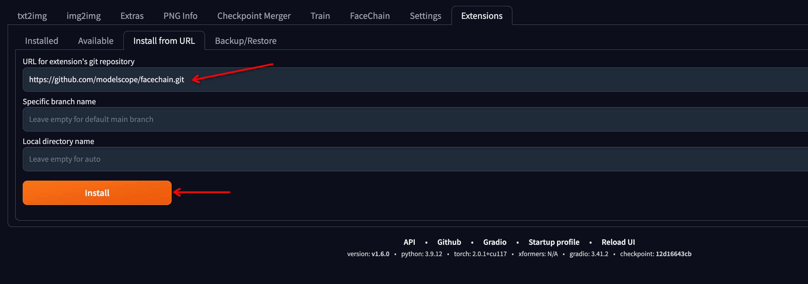
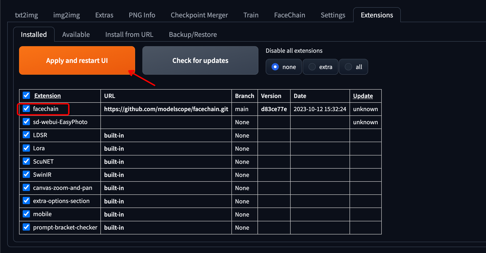
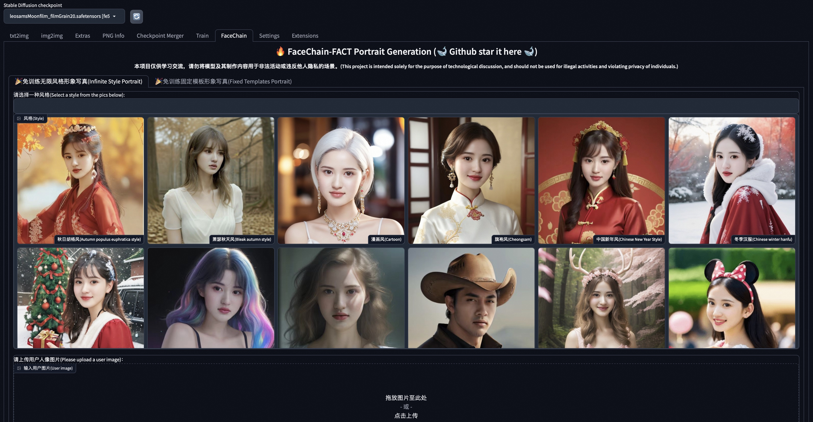
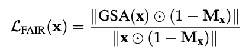

<p align="center">
    <br>
    
    <br>
    <h1>FaceChain</h1>
<p>

# 最新消息
- 更多关于FaceChain-FACT免训练工作的技术细节可以在 [论文](https://arxiv.org/abs/2410.12312) 里查看. (2024-10-17)
- Facechain算法创新工作[TopoFR](https://arxiv.org/abs/2410.10587) 被NeurIPS 2024接收录用! (2024-09-26)
- 添加自定义风格模型训练，可全自动训练生成自定义风格LoRa模型以及对应的风格提示词，并在无限风格写真页面支持对训练的自定义风格模型的一键式调用！（2024-07-03）
- 🚀🚀🚀 正在推出[FACT]到主目录，10秒写真出图，兼容现成的LoRa与ControlNet，并且具备更强的指令跟随能力！原始版本已移至(https://github.com/modelscope/facechain/tree/v3.0.0 )。(2024-05-28)
- FaceChain两项算法创新工作[FaceChain-ImagineID](https://arxiv.org/abs/2403.01901)与[FaceChain-SuDe](https://arxiv.org/abs/2403.06775)被CVPR 2024接收录用! (2024-02-27)

# 介绍

FaceChain是一个可以用来生成个人写真的深度学习模型工具。在最新的FaceChain FACT版本中，用户仅需要提供一张照片即可10秒钟获得独属于自己的个人写真（支持多种风格）。FaceChain可实现兼具可控性与ID保持能力的无限风格写真与固定模板写真功能，同时对ControlNet和LoRA具有优秀的兼容能力。FaceChain支持在gradio的界面中使用模型训练和推理能力、支持资深开发者使用python脚本进行训练推理，也支持在sd webui中安装插件使用。同时，我们也欢迎开发者对本Repo进行继续开发和贡献。
FaceChain的模型由[ModelScope](https://github.com/modelscope/modelscope)开源模型社区提供支持。

<p align="center">
        ModelScope Studio <a href="https://modelscope.cn/studios/CVstudio/FaceChain-FACT">🤖<a></a>&nbsp ｜API <a href="https://help.aliyun.com/zh/dashscope/developer-reference/facechain-quick-start">🔥<a></a>&nbsp | SD WebUI | HuggingFace Space <a href="https://huggingface.co/spaces/modelscope/FaceChain-FACT">🤗</a>&nbsp 
</p>
<br>

<a href='https://facechain-fact.github.io/'></a>  [](https://youtu.be/DHqEl0qwi-M?si=y6VpInXdhIX0HpbI)


# News
- 更多关于FaceChain-FACT免训练工作的技术细节可以在 [论文](https://arxiv.org/abs/2410.12312) 里查看. (2024-10-17)
- Facechain算法创新工作[TopoFR](https://arxiv.org/abs/2410.10587) 被NeurIPS 2024接收录用! (2024-09-26)
- 添加自定义风格模型训练，可全自动训练生成自定义风格LoRa模型以及对应的风格提示词，并在无限风格写真页面支持对训练的自定义风格模型的一键式调用！（2024-07-03）
- 🚀🚀🚀 正在推出[FACT]，10秒写真出图，兼容现成的LoRa与ControlNet，并且具备更强的指令跟随能力！(2024-05-28)
- FaceChain两项算法创新工作[FaceChain-ImagineID](https://arxiv.org/abs/2403.01901)与[FaceChain-SuDe](https://arxiv.org/abs/2403.06775)被CVPR 2024接收录用! (2024-02-27)
- 🏆🏆🏆阿里巴巴年度开源新锐项目、阿里巴巴年度开源先锋人物-技术贡献（刘洋）、阿里巴巴年度开源先锋人物-生态贡献（孙佰贵）. (2024-01-20)
- 与NUS团队合作的[InfoBatch](https://github.com/henryqin1997/InfoBatch) 被ICLR 2024(Oral)录用! pytorch中只用3行代码的版本PR中. (2024-01-16)
- 🏆开放原子2023快速成长开源项目奖项. (2023-12-20)
- 支持SDXL模块🔥🔥🔥，出图细腻度大幅提升. (November 22th, 2023 UTC)
- 支持超分模块🔥🔥🔥，目前多种分辨率可选 (512*512, 768*768, 1024*1024, 2048*2048). (November 13th, 2023 UTC)
- 🏆FaceChain入选[BenchCouncil Open100 (2022-2023)](https://www.benchcouncil.org/evaluation/opencs/annual.html#Institutions) 开源榜单. (2023-11-08)
- 增加虚拟试衣模块，可基于包含给定服饰的模特图或人台图进行重绘. (2023-10-27)
- 增加万相版本[在线免费应用](https://tongyi.aliyun.com/wanxiang/app/portrait-gallery). (2023-10-26)
- 🏆1024程序员节AIGC应用工具最具商业价值奖. (2023-10-24)
- stable-diffusion-webui支持🔥🔥🔥. (2023-10-13)
- 高性能的(单人&双人)模版重绘功能，简化用户界面. (2023-09-09)
- 更多技术细节可以在 [论文](https://arxiv.org/abs/2308.14256) 里查看. (2023-08-30)
- 为Lora训练添加验证和根据face_id的融合，并添加InpaintTab（目前在Gradio界面上暂时默认隐藏）. (2023-08-28)
- 增加姿势控制模块，可一键体验模版pose复刻. (2023-08-27)
- 增加鲁棒性人脸lora训练，提升单图训练&风格lora融合的效果. (2023-08-27)
- 支持在HuggingFace Space中体验FaceChain ！ <a href="https://huggingface.co/spaces/modelscope/FaceChain">🤗</a>      (2023-08-25)
- 新增高质量提示词模板，欢迎大家一起贡献！ 参考 [awesome-prompts-facechain](resources/awesome-prompts-facechain.txt)    (2023-08-18)
- 支持即插即用的风格LoRA模型！ (2023-08-16)
- 新增个性化prompt模块！ (2023-08-16)
- Colab notebook安装已支持，您可以直接打开链接体验FaceChain： [](https://colab.research.google.com/github/modelscope/facechain/blob/main/facechain_demo.ipynb)   (2023-08-15)


# 待办事项
- 全身数字人


# 引用

如果FaceChain对您的研究有所帮助，请在您的出版物中引用FaceChain及FaceChain-FACT
```
@article{liu2023facechain,
  title={FaceChain: A Playground for Identity-Preserving Portrait Generation},
  author={Liu, Yang and Yu, Cheng and Shang, Lei and Wu, Ziheng and 
          Wang, Xingjun and Zhao, Yuze and Zhu, Lin and Cheng, Chen and 
          Chen, Weitao and Xu, Chao and Xie, Haoyu and Yao, Yuan and 
          Zhou,  Wenmeng and Chen Yingda and Xie, Xuansong and Sun, Baigui},
  journal={arXiv preprint arXiv:2308.14256},
  year={2023}
```
```
@article{yu2024facechain,
  title={FaceChain-FACT: Face Adapter with Decoupled Training for Identity-preserved Personalization},
  author={Yu, Cheng and Xie, Haoyu and Shang, Lei and Liu, Yang and Dan, Jun and Sun, Baigui and Bo, Liefeng},
  journal={arXiv preprint arXiv:2410.12312},
  year={2024}
}
```

# 环境准备

## 兼容性验证
FaceChain是一个组合模型，基于PyTorch机器学习框架，以下是已经验证过的主要环境依赖：
- python环境: py3.8, py3.10
- pytorch版本: torch2.0.0, torch2.0.1
- CUDA版本: 11.7
- CUDNN版本: 8+
- 操作系统版本: Ubuntu 20.04, CentOS 7.9
- GPU型号: Nvidia-A10 24G

## 内存优化
推荐安装Jemalloc以节省内存占用，可将内存由约30G降至20G以下。以Modelscope notebook为例，Jemalloc的安装指令如下：

```shell
apt-get install -y libjemalloc-dev
export LD_PRELOAD=/lib/x86_64-linux-gnu/libjemalloc.so
```

## 资源要求
- GPU: 显存占用约19G
- 磁盘: 推荐预留50GB以上的存储空间


## 安装指南
支持以下几种安装方式，任选其一：

### 1. 使用ModelScope提供的notebook环境【推荐】
ModelScope(魔搭社区)提供给新用户初始的免费计算资源，参考[ModelScope Notebook](https://modelscope.cn/my/mynotebook/preset)
    
如果初始免费计算资源无法满足要求，您还可以从上述页面开通付费流程，以便创建一个准备就绪的ModelScope(GPU) DSW镜像实例。
    
Notebook环境使用简单，您只需要按以下步骤操作（注意：目前暂不提供永久存储，实例重启后数据会丢失）：


```shell
# Step1: 我的notebook -> PAI-DSW -> GPU环境
# 注意: 请选择以下镜像: ubuntu20.04-py38-torch2.0.1-tf1.15.5-modelscope1.8.1

# Step2: 进入Notebook cell，执行下述命令从github clone代码：
!GIT_LFS_SKIP_SMUDGE=1 git clone https://github.com/modelscope/facechain.git --depth 1

# Step3: 切换当前工作路径，安装依赖
import os
os.chdir('/mnt/workspace/facechain')    # 注意替换成上述clone后的代码文件夹主路径
print(os.getcwd())

!pip3 install gradio==3.47.1
!pip3 install controlnet_aux==0.0.6
!pip3 install python-slugify
!pip3 install diffusers==0.29.0
!pip3 install peft==0.11.1
!pip3 install modelscope -U
!pip3 install datasets==2.16

# Step4: 启动服务，点击生成的URL即可访问web页面，上传照片开始训练和预测
!python3 app.py

```

除了ModelScope入口以外，您也可以前往[PAI-DSW](https://www.aliyun.com/activity/bigdata/pai/dsw) 直接购买带有ModelScope镜像的计算实例（推荐使用A10资源），这样同样可以使用如上的最简步骤运行起来。


### 2. docker镜像

如果您熟悉docker，可以使用我们提供的docker镜像，其包含了模型依赖的所有组件，无需复杂的环境安装：
```shell
# Step1: 机器资源
您可以使用本地或云端带有GPU资源的运行环境。
如需使用阿里云ECS，可访问： https://www.aliyun.com/product/ecs，推荐使用”镜像市场“中的CentOS 7.9 64位(预装NVIDIA GPU驱动)

# Step2: 将镜像下载到本地 （前提是已经安装了docker engine并启动服务，具体可参考： https://docs.docker.com/engine/install/）
# For China Mainland users:
docker pull registry.cn-hangzhou.aliyuncs.com/modelscope-repo/modelscope:ubuntu20.04-cuda11.7.1-py38-torch2.0.1-tf1.15.5-1.8.1
# For users outside China Mainland:
docker pull registry.us-west-1.aliyuncs.com/modelscope-repo/modelscope:ubuntu20.04-cuda11.7.1-py38-torch2.0.1-tf1.15.5-1.8.1

# Step3: 拉起镜像运行
docker run -it --name facechain -p 7860:7860 --gpus all registry.cn-hangzhou.aliyuncs.com/modelscope-repo/modelscope:ubuntu20.04-cuda11.7.1-py38-torch2.0.1-tf1.15.5-1.8.1 /bin/bash
# 注意： 如果提示无法使用宿主机GPU的错误，可能需要安装nvidia-container-runtime
# 1. 安装nvidia-container-runtime：https://docs.nvidia.com/datacenter/cloud-native/container-toolkit/latest/install-guide.html
# 2. 重启docker服务：sudo systemctl restart docker

# Step4: 在容器中安装gradio
pip3 install gradio==3.47.1
pip3 install controlnet_aux==0.0.6
pip3 install python-slugify
pip3 install diffusers==0.29.0
pip3 install peft==0.11.1
pip3 install modelscope -U
pip3 install datasets==2.16

# Step5: 获取facechain源代码
GIT_LFS_SKIP_SMUDGE=1 git clone https://github.com/modelscope/facechain.git --depth 1
cd facechain
python3 app.py
# Note: FaceChain目前支持单卡GPU，如果您的环境有多卡，请使用如下命令
# CUDA_VISIBLE_DEVICES=0 python3 app.py

# Step6: 点击 "public URL", 形式为 https://xxx.gradio.live
```

### 3. stable-diffusion-webui中运行

1. 选择`Extensions Tab`，选择`Install From URL`（官方插件集成中，先从URL安装）。
   

2. 切换到`Installed`，勾选FaceChain插件，点击`Apply and restart UI`。安装环境依赖和下载模型可能需要花费较长时间。请确认CUDA Toolkit已安装，否则mmcv的安装将会报错。
   

3. 页面刷新后，出现`FaceChain`选项说明安装成功。
   

# 脚本运行

如果不想启动服务，而是直接在命令行进行开发调试等工作，FaceChain也支持在python环境中直接运行脚本进行训练和推理。进行无限风格写真生成时，请编辑run_inference.py中的代码:

```python
# 使用深度控制，默认False，仅在使用姿态控制时生效
use_pose_model = False
# 输入用户图像
input_img_path = 'poses/man/pose2.png'
# 姿态控制图片路径，仅在使用姿态控制时生效
pose_image = 'poses/man/pose1.png'
# 推理生成的图片数量
num_generate = 5
# 风格模型权重，详情可参考styles文件夹
multiplier_style = 0.25
# 指定一个保存生成的图片的文件夹，本参数可以根据需要修改
output_dir = './generated'
# 基模型的索引编号，详情可参考facechain/constants.py
base_model_idx = 0
# 风格模型的索引编号，详情可参考styles文件夹
style_idx = 0
```

之后执行：

```python
python run_inference.py
```

即可在`output_dir`中找到生成的个人写真照片。

进行固定模板写真生成时，请编辑run_inference_inpaint.py中的代码:

```python
# 模板图像的人脸数量
num_faces = 1
# 用于重绘的人脸编号，按从左至右的顺序
selected_face = 1
# 模板重回强度参数，该参数建议谨慎调整
strength = 0.6
# 输入模板图像
inpaint_img = 'poses/man/pose1.png'
# 输入用户图像
input_img_path = 'poses/man/pose2.png'
# 推理生成的图片数量
num_generate = 1
# 指定一个保存生成的图片的文件夹，本参数可以根据需要修改
output_dir = './generated_inpaint'
```

之后执行：

```shell
python run_inference_inpaint.py
```

即可在`output_dir`中找到生成的个人写真照片。
                                             
# 算法介绍

AI写真的能力来源于以Stable Diffusion为代表的文生图大模型及其微调技术。由于大模型具有强大的泛化能力，因此可以通过在单一类型的数据和任务中进行微调的方式，在保持模型整体的文本跟随和图像生成能力的基础上，实现下游任务。基于训练和免训练的AI写真的技术基础就来自于对文生图模型进行不同的微调任务。目前市面上的AI写真大多采用“训练+生成”的两阶段模式，此时的微调任务为“生成固定人物ID的写真图片”，对应的训练数据为多张该人物ID的形象图片。该模式的效果与训练数据的规模成正相关，因此往往需要庞大的形象数据支撑以及一定的训练时间，这也增加了用户的使用成本。

不同于上述模式，免训练的AI写真将微调任务调整为“生成指定人物ID的写真图片”，即将人物ID形象图片（人脸图片）作为额外的输入，输出具有与输入形象具有相同ID特征的写真图片。该模式可以将线下训练与线上推理彻底分离，用户使用时直接基于微调后的模型进行写真生成，仅需一张图片，无需大量数据和训练等待时间，10秒钟即可生成专属AI写真。免训练AI写真的微调任务的基础算法是基于适配器（adapter）模块实现的，人脸图片经过固定权重的图像编码器（image encoder）以及低参数量的特征投影层得到对齐后的特征，而后通过对固定权重的Stable Diffusion中的U-Net模块添加与文本条件类似的注意力机制模块实现对模型的微调。此时人脸信息作为独立分支的条件平行于文本信息一起送入模型中进行推理，故而可以使生成图片具有ID保持能力。

基于face adapter的基础算法尽管可以实现免训练AI写真，但仍需进行一定的调整以进一步优化其效果。市面上的免训练写真工具往往存在以下几点问题：写真图像质量差、写真文本跟随能力和风格保持能力不佳、写真人脸可控性和丰富度差、算法对ControlNet和风格Lora的兼容性不好等。针对上述问题，FaceChain将其归结于已有的用于免训练AI写真的微调任务耦合了过多人物ID以外的信息，并提出了解耦训练的人脸适配器算法（FaceChain Face Adapter with deCoupled Training，FaceChain FACT）以解决上述问题。通过在百万级别的写真数据上对Stable Diffusion模型进行微调，FaceChain FACT可以实现高质量的指定人物ID的写真图片生成。FaceChain FACT的整个框架如下图所示。


FaceChain FACT的解耦训练分为两个部分：从图像解耦人脸，以及从人脸解耦ID。已有方法往往将写真图像去噪作为微调任务，从而导致模型无法将注意力准确定位到人脸区域，从而导致Stable Diffusion的原有文生图功能受到影响。FaceChain FACT借鉴换脸算法的串行处理以及区域控制的优势，从结构和训练策略两方面实现从图像中解耦人脸的微调方法。在结构上，不同于已有方法使用并行的交叉注意力机制处理人脸和文本信息，FaceChain FACT采用串行处理的方法作为独立的adapter层插入原始Stable Diffusion的block中，从而将人脸适配作为类似换脸处理的独立步骤作用于去噪过程中，避免了彼此之间的干扰。在训练策略上，FaceChain FACT在原始的MSE损失函数的基础上引入人脸适配增量正则（Face Adapting Incremental Regularization，FAIR）损失函数，控制adapter层人脸适配步骤的特征增量集中于人脸区域。在推理过程中，用户可以通过调整face adapter的权重灵活调节生成效果，在保持Stable Diffusion原有文生图功能的同时，平衡人脸的保真度与泛化性。FAIR损失函数的具体形式如下所示：



此外，针对写真人脸可控性和丰富度差的问题，FaceChain FACT提出从人脸解耦ID的训练方法，使得写真过程仅控制人物ID而非整个人脸。首先，为了更针对性提取人脸的ID信息并保持部分关键人脸细节，并且更好适应Stable Diffusion的结构，FaceChain FACT采用在大量人脸数据上预训练的基于Transformer架构的人脸特征提取器[TransFace](https://github.com/DanJun6737/TransFace)，抽取其倒数第二层的全部token，后续连接简单的注意力查询模型进行特征投影，从而使得提取的ID特征兼顾上述三点要求。另外，在训练过程中，FaceChain FACT使用Classifier Free Guidance（CFG）的方法，对相同ID对不同人脸写真图片进行随机打乱和舍弃，从而使得模型的输入人脸图片和用于去噪的目标图片可能具有同ID的不同人脸，以进一步避免模型过拟合于人脸的非ID信息。FaceChain FACT对FaceChain海量的精美风格以及姿态控制等功能具有丝滑的兼容能力，生成写真图像如下所示。

   

## 模型列表

FaceChain使用的模型链接：

[1]  人脸识别模型TransFace：https://www.modelscope.cn/models/iic/cv_vit_face-recognition

[2]  人脸检测+关键点模型DamoFD：https://modelscope.cn/models/damo/cv_ddsar_face-detection_iclr23-damofd

[3]  人体解析模型M2FP：https://modelscope.cn/models/damo/cv_resnet101_image-multiple-human-parsing

[4]  人像美肤模型ABPN：https://www.modelscope.cn/models/damo/cv_unet_skin_retouching_torch

[5]  人脸融合模型：https://www.modelscope.cn/models/damo/cv_unet_face_fusion_torch

[6]  FaceChain FACT使用模型：https://www.modelscope.cn/models/yucheng1996/FaceChain-FACT

[7]  人脸属性识别模型FairFace：https://modelscope.cn/models/damo/cv_resnet34_face-attribute-recognition_fairface

# 更多信息

- [ModelScope library](https://github.com/modelscope/modelscope/)

  ModelScope Library是一个托管于github上的模型生态仓库，隶属于达摩院魔搭项目。

- [贡献模型到ModelScope](https://modelscope.cn/docs/ModelScope%E6%A8%A1%E5%9E%8B%E6%8E%A5%E5%85%A5%E6%B5%81%E7%A8%8B%E6%A6%82%E8%A7%88)

# License

This project is licensed under the [Apache License (Version 2.0)](https://github.com/modelscope/modelscope/blob/master/LICENSE).

