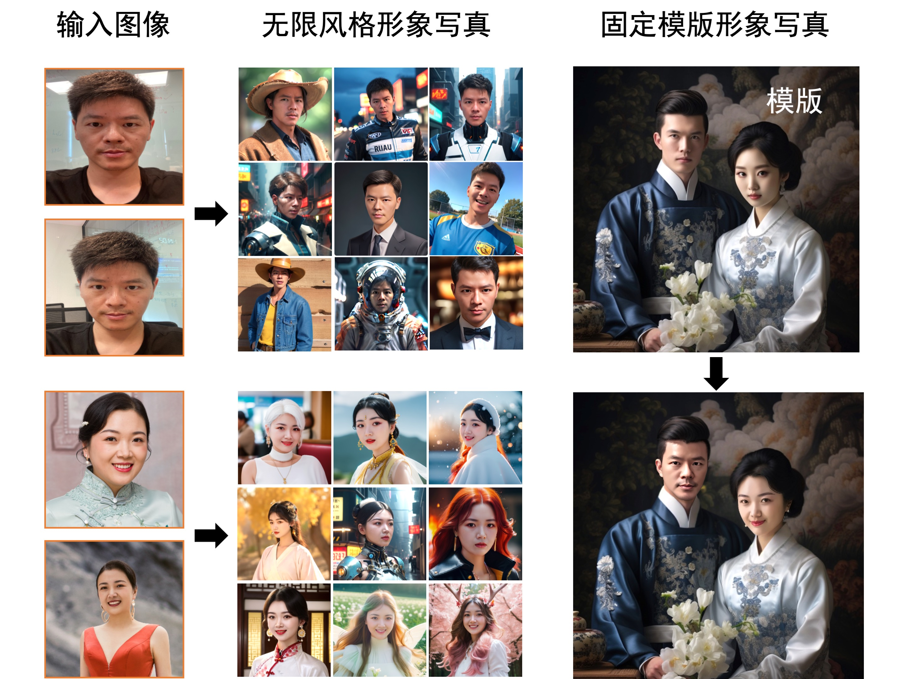

<p align="center">
    <br>
    
    <br>
    <h1>FaceChain</h1>
<p>


# 介绍

FaceChain是一个可以用来打造个人数字形象的深度学习模型工具。用户仅需要提供最低一张照片即可获得独属于自己的个人形象数字替身。FaceChain支持在gradio的界面中使用模型训练和推理能力、支持资深开发者使用python脚本进行训练推理，也支持在sd webui中安装插件使用；同时，我们也欢迎开发者对本Repo进行继续开发和贡献。
FaceChain的模型由[ModelScope](https://github.com/modelscope/modelscope)开源模型社区提供支持。

<p align="center">
        ModelScope Studio <a href="https://modelscope.cn/studios/CVstudio/cv_human_portrait/summary">🤖<a></a>&nbsp ｜ sd webui ｜ HuggingFace Space <a href="https://huggingface.co/spaces/modelscope/FaceChain">🤗</a>&nbsp 
</p>
<br>




# News
- 1024程序员节AIGC应用工具最具商业价值奖 (2023-10-24)
- stable-diffusion-webui支持🔥🔥🔥. (2023-10-13)
- 高性能的(单人&双人)模版重绘功能，简化用户界面. (2023-09-09)
- 更多技术细节可以在 [论文](https://arxiv.org/abs/2308.14256) 里查看. (2023-08-30)
- 为Lora训练添加验证和根据face_id的融合，并添加InpaintTab（目前在Gradio界面上暂时默认隐藏）. (2023-08-28)
- 增加姿势控制模块，可一键体验模版pose复刻. (2023-08-27)
- 增加鲁棒性人脸lora训练，提升单图训练&风格lora融合的效果. (2023-08-27)
- 支持在HuggingFace Space中体验FaceChain ！ <a href="https://huggingface.co/spaces/modelscope/FaceChain">🤗</a>      (2023-08-25)
- 新增高质量提示词模板，欢迎大家一起贡献！ 参考 [awesome-prompts-facechain](resources/awesome-prompts-facechain.txt)    (2023-08-18)
- 支持即插即用的风格LoRA模型！ (2023-08-16)
- 新增个性化prompt模块！ (2023-08-16)
- Colab notebook安装已支持，您可以直接打开链接体验FaceChain： [](https://colab.research.google.com/github/modelscope/facechain/blob/main/facechain_demo.ipynb)   (2023-08-15)


# 待办事项
- 现成风格模型即插即用（以C站风格模型为例）   --迭代中
- 增加更多美肤功能
- 适配更多的基模，例如SDXL
- 增加超分模块
- 支持多人保id照片生成
- 开发更多好玩的app


# Citation

如果FaceChain对您的研究有所帮助，请在您的出版物中引用FaceChain
```
@article{liu2023facechain,
  title={FaceChain: A Playground for Identity-Preserving Portrait Generation},
  author={Liu, Yang and Yu, Cheng and Shang, Lei and Wu, Ziheng and 
          Wang, Xingjun and Zhao, Yuze and Zhu, Lin and Cheng, Chen and 
          Chen, Weitao and Xu, Chao and Xie, Haoyu and Yao, Yuan and 
          Zhou,  Wenmeng and Chen Yingda and Xie, Xuansong and Sun, Baigui},
  journal={arXiv preprint arXiv:2308.14256},
  year={2023}
```

# 环境准备

## 兼容性验证
FaceChain是一个组合模型，使用了包括PyTorch和TensorFlow在内的机器学习框架，以下是已经验证过的主要环境依赖：
- python环境: py3.8, py3.10
- pytorch版本: torch2.0.0, torch2.0.1
- tensorflow版本: 2.8.0, tensorflow-cpu
- CUDA版本: 11.7
- CUDNN版本: 8+
- 操作系统版本: Ubuntu 20.04, CentOS 7.9
- GPU型号: Nvidia-A10 24G


## 资源要求
- GPU: 显存占用约19G
- 磁盘: 推荐预留50GB以上的存储空间


## 安装指南
支持以下几种安装方式，任选其一：

### 1. 使用ModelScope提供的notebook环境【推荐】
ModelScope(魔搭社区)提供给新用户初始的免费计算资源，参考[ModelScope Notebook](https://modelscope.cn/my/mynotebook/preset)
    
如果初始免费计算资源无法满足要求，您还可以从上述页面开通付费流程，以便创建一个准备就绪的ModelScope(GPU) DSW镜像实例。
    
Notebook环境使用简单，您只需要按以下步骤操作（注意：目前暂不提供永久存储，实例重启后数据会丢失）：


```shell
# Step1: 我的notebook -> PAI-DSW -> GPU环境

# Step2: 进入Notebook cell，执行下述命令从github clone代码：
!GIT_LFS_SKIP_SMUDGE=1 git clone https://github.com/modelscope/facechain.git --depth 1

# Step3: 切换当前工作路径
import os
os.chdir('/mnt/workspace/facechain')    # 注意替换成上述clone后的代码文件夹主路径
print(os.getcwd())

!pip3 install gradio
!pip3 install controlnet_aux==0.0.6
!pip3 install python-slugify
!python3 app.py

# Step4: 点击生成的URL即可访问web页面，上传照片开始训练和预测
```

除了ModelScope入口以外，您也可以前往[PAI-DSW](https://www.aliyun.com/activity/bigdata/pai/dsw) 直接购买带有ModelScope镜像的计算实例（推荐使用A10资源），这样同样可以使用如上的最简步骤运行起来。


### 2. docker镜像

如果您熟悉docker，可以使用我们提供的docker镜像，其包含了模型依赖的所有组件，无需复杂的环境安装：
```shell
# Step1: 机器资源
您可以使用本地或云端带有GPU资源的运行环境。
如需使用阿里云ECS，可访问： https://www.aliyun.com/product/ecs，推荐使用”镜像市场“中的CentOS 7.9 64位(预装NVIDIA GPU驱动)

# Step2: 将镜像下载到本地 （前提是已经安装了docker engine并启动服务，具体可参考： https://docs.docker.com/engine/install/）
docker pull registry.cn-hangzhou.aliyuncs.com/modelscope-repo/modelscope:ubuntu20.04-cuda11.7.1-py38-torch2.0.1-tf1.15.5-1.8.0

# Step3: 拉起镜像运行
docker run -it --name facechain -p 7860:7860 --gpus all registry.cn-hangzhou.aliyuncs.com/modelscope-repo/modelscope:ubuntu20.04-cuda11.7.1-py38-torch2.0.1-tf1.15.5-1.8.0 /bin/bash  # 注意 your_xxx_image_id 替换成你的镜像id
# (注意： 如果提示无法使用宿主机GPU的错误，可能需要安装nvidia-container-runtime, 参考：https://github.com/NVIDIA/nvidia-container-runtime)

# Step4: 在容器中安装gradio
pip3 install gradio
pip3 install controlnet_aux==0.0.6
pip3 install python-slugify

# Step5: 获取facechain源代码
GIT_LFS_SKIP_SMUDGE=1 git clone https://github.com/modelscope/facechain.git --depth 1
cd facechain
python3 app.py
# Note: FaceChain目前支持单卡GPU，如果您的环境有多卡，请使用如下命令
# CUDA_VISIBLE_DEVICES=0 python3 app.py

# Step6: 点击 "public URL", 形式为 https://xxx.gradio.live
```


### 3. conda虚拟环境

使用conda虚拟环境，参考[Anaconda](https://docs.anaconda.com/anaconda/install/)来管理您的依赖，安装完成后，执行如下命令：
(提示： mmcv对环境要求较高，可能出现不适配的情况，推荐使用docker方式)

```shell
conda create -n facechain python=3.8    # 已验证环境：3.8 和 3.10
conda activate facechain

GIT_LFS_SKIP_SMUDGE=1 git clone https://github.com/modelscope/facechain.git --depth 1
cd facechain

pip3 install -r requirements.txt
pip3 install -U openmim 
mim install mmcv-full==1.7.0

# 进入facechain文件夹，执行：
python3 app.py
# Note: FaceChain目前支持单卡GPU，如果您的环境有多卡，请使用如下命令
# CUDA_VISIBLE_DEVICES=0 python3 app.py

# 最后点击log中生成的URL即可访问页面。
```

备注：如果是Windows环境还需要注意以下步骤：
```shell
# 1. 重新安装pytorch、与tensorflow匹配的numpy
# 2. pip方式安装mmcv-full: pip3 install mmcv-full
```

**如果您想要使用"人物说话视频生成"标签页的功能，请参考[installation_for_talkinghead_ZH](doc/installation_for_talkinghead_ZH.md)里的安装使用教程。**


### 4. colab运行

| Colab | Info
| --- | --- |
[](https://colab.research.google.com/github/modelscope/facechain/blob/main/facechain_demo.ipynb) | FaceChain Installation on Colab


### 5. stable-diffusion-webui中运行
1. 选择`Extensions Tab`， 选择`Install From URL`(官方插件集成中，先从URL安装)


2. 切换到`Installed`，勾选FaceChain插件，点击`Apply and restart UI`


3. 页面刷新后，出现`FaceChain` Tab说明安装成功


备注：app服务成功启动后，在log中访问页面URL，进入”形象定制“tab页，点击“选择图片上传”，并最少选1张包含人脸的图片；点击“开始训练”即可训练模型。训练完成后日志中会有对应展示，之后切换到“形象体验”标签页点击“开始生成”即可生成属于自己的数字形象。

# 脚本运行

如果不想启动服务，而是直接在命令行进行开发调试等工作，FaceChain也支持在python环境中直接运行脚本进行训练和推理。在克隆后的文件夹中直接运行如下命令来进行训练：

```shell
PYTHONPATH=. sh train_lora.sh "ly261666/cv_portrait_model" "v2.0" "film/film" "./imgs" "./processed" "./output"
```

参数含义：

```text
ly261666/cv_portrait_model: ModelScope模型仓库的stable diffusion基模型，该模型会用于训练，可以不修改
v2.0: 该基模型的版本号，可以不修改
film/film: 该基模型包含了多个不同风格的子目录，其中使用了film/film目录中的风格模型，可以不修改
./imgs: 本参数需要用实际值替换，本参数是一个本地文件目录，包含了用来训练和生成的原始照片
./processed: 预处理之后的图片文件夹，这个参数需要在推理中被传入相同的值，可以不修改
./output: 训练生成保存模型weights的文件夹，可以不修改
```

等待5-20分钟即可训练完成。用户也可以调节其他训练超参数，训练支持的超参数可以查看`train_lora.sh`的配置，或者`facechain/train_text_to_image_lora.py`中的完整超参数列表。

进行推理时，请编辑run_inference.py中的代码:

```python
# 使用深度控制，默认False，仅在使用姿态控制时生效
use_depth_control = False
# 使用姿态控制，默认False
use_pose_model = False
# 姿态控制图片路径，仅在使用姿态控制时生效
pose_image = 'poses/man/pose1.png'
# 填入上述的预处理之后的图片文件夹，需要和训练时相同
processed_dir = './processed'
# 推理生成的图片数量
num_generate = 5
# 训练时使用的stable diffusion基模型，可以不修改
base_model = 'ly261666/cv_portrait_model'
# 该基模型的版本号，可以不修改
revision = 'v2.0'
# 该基模型包含了多个不同风格的子目录，其中使用了film/film目录中的风格模型，可以不修改
base_model_sub_dir = 'film/film'
# 训练生成保存模型weights的文件夹，需要保证和训练时相同
train_output_dir = './output'
# 指定一个保存生成的图片的文件夹，本参数可以根据需要修改
output_dir = './generated'
# 使用凤冠霞帔风格模型，默认False
use_style = False
```

之后执行：

```python
python run_inference.py
```

即可在`output_dir`中找到生成的个人数字形象照片。
                                             
# 算法介绍

## 基本原理

个人写真模型的能力来源于Stable Diffusion模型的文生图功能，输入一段文本或一系列提示词，输出对应的图像。我们考虑影响个人写真生成效果的主要因素：写真风格信息，以及用户人物信息。为此，我们分别使用线下训练的风格LoRA模型和线上训练的人脸LoRA模型以学习上述信息。LoRA是一种具有较少可训练参数的微调模型，在Stable Diffusion中，可以通过对少量输入图像进行文生图训练的方式将输入图像的信息注入到LoRA模型中。因此，个人写真模型的能力分为训练与推断两个阶段，训练阶段生成用于微调Stable Diffusion模型的图像与文本标签数据，得到人脸LoRA模型；推断阶段基于人脸LoRA模型和风格LoRA模型生成个人写真图像。  
    


## 训练阶段

输入：用户上传的包含清晰人脸区域的图像
                                             
输出：人脸LoRA模型
                                             
描述：首先，我们分别使用基于朝向判断的图像旋转模型，以及基于人脸检测和关键点模型的人脸精细化旋转方法处理用户上传图像，得到包含正向人脸的图像；接下来，我们使用人体解析模型和人像美肤模型，以获得高质量的人脸训练图像；随后，我们使用人脸属性模型和文本标注模型，结合标签后处理方法，产生训练图像的精细化标签；最后，我们使用上述图像和标签数据微调Stable Diffusion模型得到人脸LoRA模型。

## 推断阶段

输入：训练阶段用户上传图像，预设的用于生成个人写真的输入提示词
                                             
输出：个人写真图像
                                             
描述：首先，我们将人脸LoRA模型和风格LoRA模型的权重融合到Stable Diffusion模型中；接下来，我们使用Stable Diffusion模型的文生图功能，基于预设的输入提示词初步生成个人写真图像；随后，我们使用人脸融合模型进一步改善上述写真图像的人脸细节，其中用于融合的模板人脸通过人脸质量评估模型在训练图像中挑选；最后，我们使用人脸识别模型计算生成的写真图像与模板人脸的相似度，以此对写真图像进行排序，并输出排名靠前的个人写真图像作为最终输出结果。    

## 模型列表

附（流程图中模型链接）

[1]  人脸检测+关键点模型DamoFD：https://modelscope.cn/models/damo/cv_ddsar_face-detection_iclr23-damofd

[2]  图像旋转模型：创空间内置模型

[3]  人体解析模型M2FP：https://modelscope.cn/models/damo/cv_resnet101_image-multiple-human-parsing

[4]  人像美肤模型ABPN：https://www.modelscope.cn/models/damo/cv_unet_skin_retouching_torch

[5]  人脸属性模型FairFace：https://modelscope.cn/models/damo/cv_resnet34_face-attribute-recognition_fairface

[6]  文本标注模型Deepbooru：https://github.com/KichangKim/DeepDanbooru

[7]  模板脸筛选模型FQA：https://modelscope.cn/models/damo/cv_manual_face-quality-assessment_fqa

[8]  人脸融合模型：https://www.modelscope.cn/models/damo/cv_unet_face_fusion_torch

[9]  人脸识别模型RTS：https://modelscope.cn/models/damo/cv_ir_face-recognition-ood_rts      

[10] 人脸说话模型：https://modelscope.cn/models/wwd123/sadtalker

# 更多信息

- [ModelScope library](https://github.com/modelscope/modelscope/)

  ModelScope Library是一个托管于github上的模型生态仓库，隶属于达摩院魔搭项目。

- [贡献模型到ModelScope](https://modelscope.cn/docs/ModelScope%E6%A8%A1%E5%9E%8B%E6%8E%A5%E5%85%A5%E6%B5%81%E7%A8%8B%E6%A6%82%E8%A7%88)

# License

This project is licensed under the [Apache License (Version 2.0)](https://github.com/modelscope/modelscope/blob/master/LICENSE).

