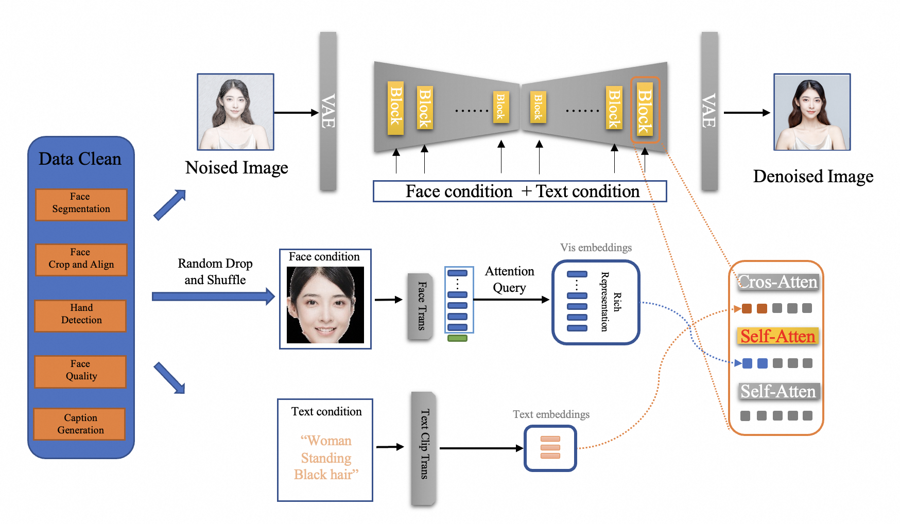

<h2 align="center">TransFace: Calibrating Transformer Training for Face Recognition from a Data-Centric Perspective
<h5 align="center"> If you like TransFace, please give us a star ⭐ on GitHub for the latest update~
</h2>

This is the official PyTorch implementation of [[ICCV-2023] TransFace: Calibrating Transformer Training for Face Recognition from a Data-Centric Perspective](https://openaccess.thecvf.com/content/ICCV2023/html/Dan_TransFace_Calibrating_Transformer_Training_for_Face_Recognition_from_a_Data-Centric_ICCV_2023_paper.html).

[[Arxiv Version]](https://arxiv.org/abs/2308.10133)


## News
- 🚀🚀🚀 TransFace is integrated in [FaceChain-FACT](https://github.com/modelscope/facechain) as a key identity-preserved module to assist Stable Diffusion in generating human portraits with fine-grained facial details and diverse styles.
In the newest FaceChain-FACT (Face Adapter with deCoupled Training) version, with only 1 photo and 10 seconds, you can generate personal portraits in different settings (multiple styles now supported!). (May 28th, 2024 UTC)

<a href='https://facechain-fact.github.io/'></a>  [](https://youtu.be/DHqEl0qwi-M?si=y6VpInXdhIX0HpbI)

 The entire framework of [FaceChain-FACT](https://github.com/modelscope/facechain) is shown in the figure below.



## ModelScope
You can quickly experience and invoke our TransFace model on the [ModelScope](https://modelscope.cn/models/damo/cv_vit_face-recognition/summary).

* Quickly utilize our model as a feature extractor to extract facial features from the input image.
```
# Usage: Input aligned facial images (112x112) to obtain a 512-dimensional facial feature vector.
# For convenience, the model integrates the RetinaFace model for face detection and keypoint estimation.
# Provide two images as input, and for each image, the model will independently perform face detection,
# select the largest face, align it, and extract the corresponding facial features.
# Finally, the model will return a similarity score indicating the resemblance between the two faces.

from modelscope.pipelines import pipeline
from modelscope.utils.constant import Tasks
from modelscope.outputs import OutputKeys
import numpy as np

face_mask_recognition_func = pipeline(Tasks.face_recognition, 'damo/cv_vit_face-recognition')
img1 = 'https://modelscope.oss-cn-beijing.aliyuncs.com/test/images/face_recognition_1.png'
img2 = 'https://modelscope.oss-cn-beijing.aliyuncs.com/test/images/face_recognition_2.png'
emb1 = face_mask_recognition_func(img1)[OutputKeys.IMG_EMBEDDING]
emb2 = face_mask_recognition_func(img2)[OutputKeys.IMG_EMBEDDING]
sim = np.dot(emb1[0], emb2[0])
print(f'Face cosine similarity={sim:.3f}, img1:{img1}  img2:{img2}')
```

## Requirements
* Install Pytorch (torch>=1.9.0)
* ```pip install -r requirement.txt```
 
## Datasets
You can download the training datasets, including MS1MV2 and Glint360K:
* MS1MV2: [Google Drive](https://drive.google.com/file/d/1SXS4-Am3bsKSK615qbYdbA_FMVh3sAvR/view)
* Glint360K: [Baidu](https://pan.baidu.com/share/init?surl=GsYqTTt7_Dn8BfxxsLFN0w) (code=:o3az)

You can download the test dataset IJB-C as follows:
* IJB-C: [Google Drive](https://drive.google.com/file/d/1aC4zf2Bn0xCVH_ZtEuQipR2JvRb1bf8o/view) 

## How to Train Models
1. You need to modify the path of training data in every configuration file in folder configs.

2. To run on a machine with 8 GPUs:
```
python -m torch.distributed.launch --nproc_per_node=8 --nnodes=1 --node_rank=0 --master_addr="127.0.0.1" --master_port=12581 train.py 
```

## How to Test Models
1. You need to modify the path of IJB-C dataset in eval_ijbc.py.

2. Run:
```
python eval_ijbc.py --model-prefix work_dirs/glint360k_vit_s/model.pt --result-dir work_dirs/glint360k_vit_s --network vit_s_dp005_mask_0 > ijbc_glint360k_vit_s.log 2>&1 &
```

## TransFace Pretrained Models 

You can download the TransFace models reported in our paper as follows:

| Training Data | Model | IJB-C(1e-6) | IJB-C(1e-5) | IJB-C(1e-4) | IJB-C(1e-3) | IJB-C(1e-2) | IJB-C(1e-1) |
| ------ | ------ | ------ | ------ | ------ | ------ | ------ | ------ |
| MS1MV2 | [TransFace-S](https://drive.google.com/file/d/1UZWCg7jNESDv8EWs7mxQSswCMGbAZNF4/view?usp=share_link) | 86.75 | 93.87 | 96.45 | 97.51 | 98.34 | 98.99 |
| MS1MV2 | [TransFace-B](https://drive.google.com/file/d/16O-q30mH8d3lECqa5eJd8rABaUlNhQ0K/view?usp=share_link) | 86.73 | 94.15 | 96.55 | 97.73 | 98.47 | 99.11 |
| MS1MV2 | [TransFace-L](https://drive.google.com/file/d/1uXUFT6ujEPqvCTHzONsp6-DMIc24Cc85/view?usp=share_link) | 86.90 | 94.55 | 96.59 | 97.80 | 98.45 | 99.04 |

| Training Data | Model | IJB-C(1e-6) | IJB-C(1e-5) | IJB-C(1e-4) | IJB-C(1e-3) | IJB-C(1e-2) | IJB-C(1e-1) |
| ------ | ------ | ------ | ------ | ------ | ------ | ------ | ------ |
| Glint360K | [TransFace-S](https://drive.google.com/file/d/18Zh_zMlYttKVIGArmDYNEchIvUSH5FQ1/view?usp=share_link) | 89.93 | 96.06 | 97.33 | 98.00 | 98.49 | 99.11 |
| Glint360K | [TransFace-B](https://drive.google.com/file/d/13IezvOo5GvtGVsRap2s5RVqtIl1y0ke5/view?usp=share_link) | 88.64 | 96.18 | 97.45 | 98.17 | 98.66 | 99.23 |
| Glint360K | [TransFace-L](https://drive.google.com/file/d/1jXL_tidh9KqAS6MgeinIk2UNWmEaxfb0/view?usp=share_link) | 89.71 | 96.29 | 97.61 | 98.26 | 98.64 | 99.19 |

You can test the accuracy of these model: (e.g. Glint360K TransFace-L)
```
python eval_ijbc.py --model-prefix work_dirs/glint360k_vit_l/glint360k_model_TransFace_L.pt --result-dir work_dirs/glint360k_vit_l --network vit_l_dp005_mask_005 > ijbc_glint360k_vit_l.log 2>&1 &
```

## Citation
* If you find it helpful for you, please consider citing our paper 📝 and giving a star ⭐.
```
@inproceedings{dan2023transface,
  title={TransFace: Calibrating Transformer Training for Face Recognition from a Data-Centric Perspective},
  author={Dan, Jun and Liu, Yang and Xie, Haoyu and Deng, Jiankang and Xie, Haoran and Xie, Xuansong and Sun, Baigui},
  booktitle={Proceedings of the IEEE/CVF International Conference on Computer Vision},
  pages={20642--20653},
  year={2023}
}
```

## Acknowledgments
We thank Insighface for the excellent [code base](https://github.com/deepinsight/insightface/tree/master/recognition/arcface_torch).

