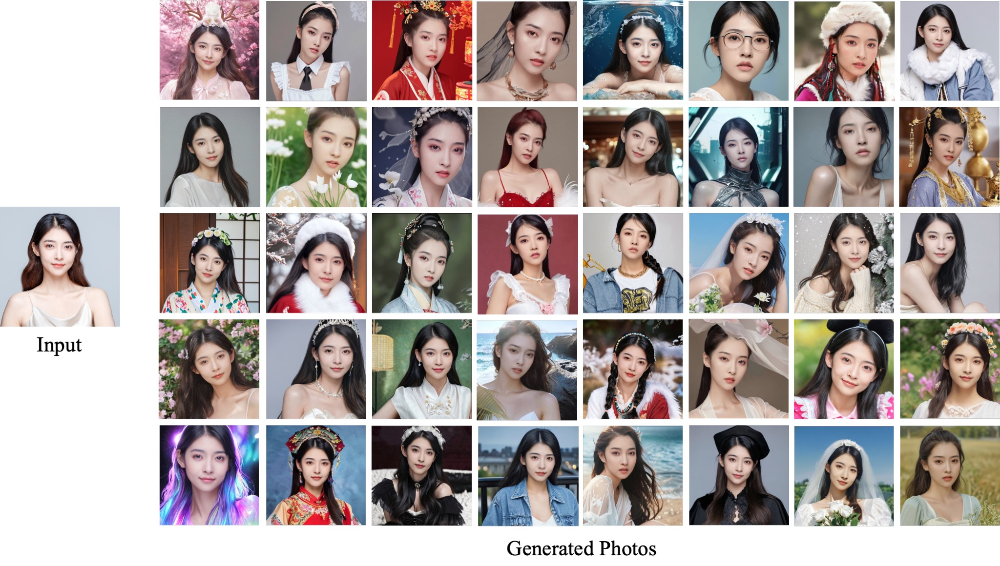
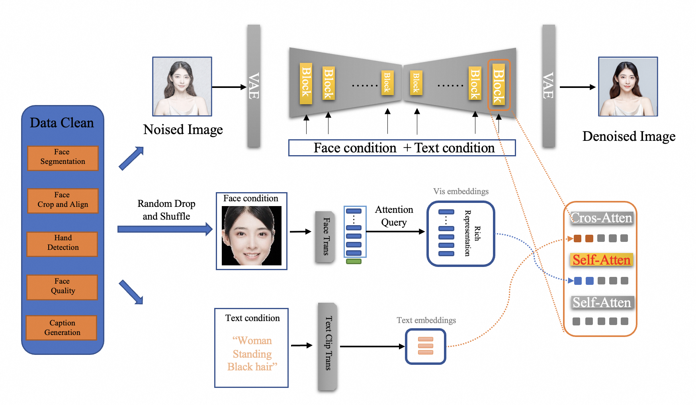

<p align="center">
    <br>
    
    <br>
    <h1>FaceChain-FACT</h1>
<p>

# Introduction

FaceChain-FACT: Face Adapter with deCoupled Training for Identity-preserved Personalization.

Cheng Yu\*, Haoyu Xie\*, Lei Shang, Yang Liu, Jun Dan, Liefeng Bo, Baigui Sun.

FaceChain-FACT (Face Adapter with deCoupled Training) is a novel framework for generating identity-preserved human portraits. With only 1 photo and 10 seconds, you can generate personal portraits in different settings (multiple styles now supported!). FaceChain-FACT has both high controllability and authenticity in portrait generation, including text-to-image and inpainting based pipelines, and is seamlessly compatible with ControlNet and LoRAs. You may generate portraits via the familiar Gradio interface with easy operations.
FaceChain-FACT is powered by [ModelScope](https://github.com/modelscope/modelscope).


<p align="center">
        ModelScope Studio <a href="https://modelscope.cn/studios/CVstudio/cv_human_portrait/summary">🤖<a></a>&nbsp ｜API <a href="https://help.aliyun.com/zh/dashscope/developer-reference/facechain-quick-start">🔥<a></a>&nbsp ｜ HuggingFace Space <a href="https://huggingface.co/spaces/modelscope/FaceChain-FACT">🤗</a>&nbsp 
</p>
<br>

<a href='https://facechain-fact.github.io/'></a>  [](https://youtu.be/DHqEl0qwi-M?si=y6VpInXdhIX0HpbI)





# To-Do List
- Develop identity-preserved whole-body portrait generation for both body shape and face.
- Develop FaceChain-FACT for SDXL base model.
- Accelerate portrait generation below one second.
- Support more style lora (such as those on Civitai).
- Provide more funny apps.


# Citation

Please cite FaceChain in your publications if it helps your research
```
@article{liu2023facechain,
  title={FaceChain: A Playground for Identity-Preserving Portrait Generation},
  author={Liu, Yang and Yu, Cheng and Shang, Lei and Wu, Ziheng and 
          Wang, Xingjun and Zhao, Yuze and Zhu, Lin and Cheng, Chen and 
          Chen, Weitao and Xu, Chao and Xie, Haoyu and Yao, Yuan and 
          Zhou,  Wenmeng and Chen Yingda and Xie, Xuansong and Sun, Baigui},
  journal={arXiv preprint arXiv:2308.14256},
  year={2023}
}
```


# Installation

## Compatibility Verification
We have verified e2e execution on the following environment:
- python: py3.8, py3.10
- pytorch: torch2.0.0, torch2.0.1
- CUDA: 11.7
- CUDNN: 8+
- OS: Ubuntu 20.04, CentOS 7.9
- GPU: Nvidia-A10 24G

## Installation Guide
The following installation methods are supported:


### 1. ModelScope notebook【recommended】

   The ModelScope Notebook offers a free-tier that allows ModelScope user to run the FaceChain application with minimum setup, refer to [ModelScope Notebook](https://modelscope.cn/my/mynotebook/preset)

```shell
# Step1: 我的notebook -> PAI-DSW -> GPU环境
# Note: Please use: ubuntu20.04-py38-torch2.0.1-tf1.15.5-modelscope1.8.1

# Step2: Entry the Notebook cell，clone FaceChain from github:
!GIT_LFS_SKIP_SMUDGE=1 git clone https://github.com/modelscope/facechain.git --depth 1

# Step3: Change the working directory to facechain, and install the dependencies:
import os
os.chdir('/mnt/workspace/facechain/facechain_adapter')    # You may change to your own path
print(os.getcwd())

!pip3 install gradio==3.47.1
!pip3 install controlnet_aux==0.0.6
!pip3 install python-slugify

# Step4: Start the app service, click "public URL" or "local URL", upload your images to 
# train your own model and then generate your digital twin.
!python3 app.py

```
   Alternatively, you may also purchase a [PAI-DSW](https://www.aliyun.com/activity/bigdata/pai/dsw) instance (using A10 resource), with the option of ModelScope image to run FaceChain following similar steps.


### 2. Docker

If you are familiar with using docker, we recommend to use this way:

```shell
# Step1: Prepare the environment with GPU on local or cloud, we recommend to use Alibaba Cloud ECS, refer to: https://www.aliyun.com/product/ecs

# Step2: Download the docker image (for installing docker engine, refer to https://docs.docker.com/engine/install/）
# For China Mainland users:
docker pull registry.cn-hangzhou.aliyuncs.com/modelscope-repo/modelscope:ubuntu20.04-cuda11.7.1-py38-torch2.0.1-tf1.15.5-1.8.1
# For users outside China Mainland:
docker pull registry.us-west-1.aliyuncs.com/modelscope-repo/modelscope:ubuntu20.04-cuda11.7.1-py38-torch2.0.1-tf1.15.5-1.8.1

# Step3: run the docker container
docker run -it --name facechain -p 7860:7860 --gpus all registry.cn-hangzhou.aliyuncs.com/modelscope-repo/modelscope:ubuntu20.04-cuda11.7.1-py38-torch2.0.1-tf1.15.5-1.8.1 /bin/bash
# Note: you may need to install the nvidia-container-runtime, follow the instructions:
# 1. Install nvidia-container-runtime：https://docs.nvidia.com/datacenter/cloud-native/container-toolkit/latest/install-guide.html
# 2. sudo systemctl restart docker

# Step4: Install the gradio in the docker container:
pip3 install gradio==3.47.1
pip3 install controlnet_aux==0.0.6
pip3 install python-slugify

# Step5 clone facechain from github
GIT_LFS_SKIP_SMUDGE=1 git clone https://github.com/modelscope/facechain.git --depth 1
cd facechain/facechain_adapter
python3 app.py
# Note: FaceChain currently assume single-GPU, if your environment has multiple GPU, please use the following instead:
# CUDA_VISIBLE_DEVICES=0 python3 app.py

# Step6
Run the app server: click "public URL" --> in the form of: https://xxx.gradio.live
```


# Algorithm Introduction

For human-centric personalized image generation, adapter-based methods learn to encode and align the input face by text-to-image training on face data, achieving identity-preserved personalization without additional fine-tuning in inference. Despite the improvement in efficiency and similarity to the input face, there generally exists significantly performance drop on the text following ability as well as the controllability and diversity for the generated face compared to the base model without adapter.
In FaceChain-FACT, we perform identity-guided face denoising instead of face-guided image denoising for decoupled training. We insert sequential face adapters between the self-attention block and the cross-attention block to perform latent face adapting contrained by Face Adapting Increment Regularization (FAIR) on the latents before text guidance, thus avoid interfering face condition with text information. For an image to denoise, the identity condition comes from a face image with the same identity by face shuffling, and is extracted by a transformer-based feature extracter.



## Model List

The models used in FaceChain-FACT:

[1]  Face detection model DamoFD：https://modelscope.cn/models/damo/cv_ddsar_face-detection_iclr23-damofd

[2]  Human parsing model M2FP：https://modelscope.cn/models/damo/cv_resnet101_image-multiple-human-parsing

[3]  Skin retouching model ABPN：https://www.modelscope.cn/models/damo/cv_unet_skin_retouching_torch

[4]  Face fusion model：https://www.modelscope.cn/models/damo/cv_unet_face_fusion_torch

[5]  FaceChain-FACT model: https://www.modelscope.cn/models/yucheng1996/FaceChain-FACT


# More Information

- [ModelScope library](https://github.com/modelscope/modelscope/)


​        ModelScope Library provides the foundation for building the model-ecosystem of ModelScope, including the interface and implementation to integrate various models into ModelScope. 

- [Contribute models to ModelScope](https://modelscope.cn/docs/ModelScope%E6%A8%A1%E5%9E%8B%E6%8E%A5%E5%85%A5%E6%B5%81%E7%A8%8B%E6%A6%82%E8%A7%88)

# License

This project is licensed under the [Apache License (Version 2.0)](https://github.com/modelscope/modelscope/blob/master/LICENSE).
