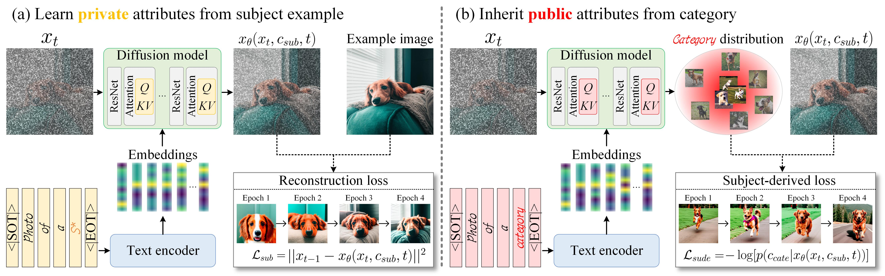
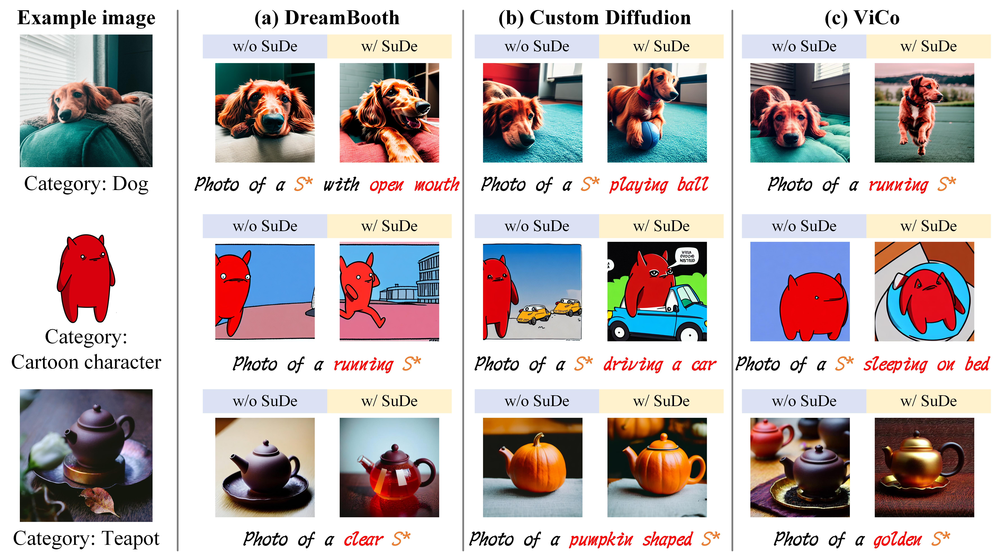
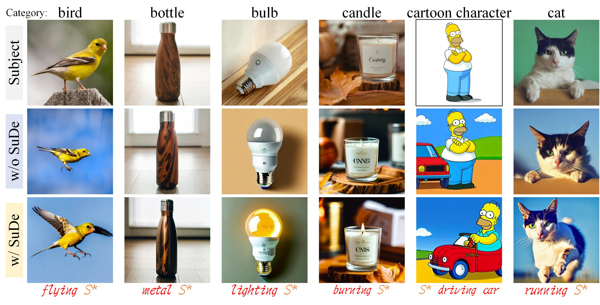
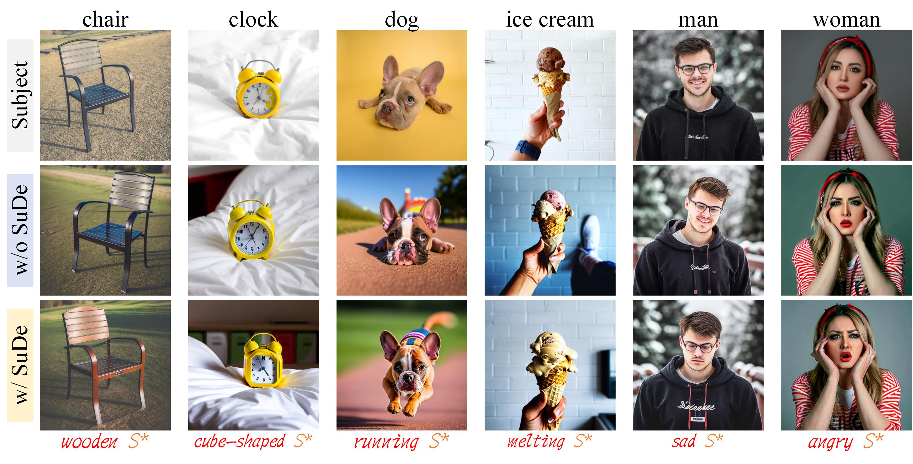

# FaceChain-SuDe: Building Derived Class to Inherit Category Attributes for One-shot Subject-Driven Generation


This is an implementtaion of [FaceChain-SuDe](https://arxiv.org/abs/2403.06775) based on [DreamBooth](https://arxiv.org/abs/2208.12242) with [Stable Diffusion](https://github.com/CompVis/stable-diffusion). 

This code repository is based on that of [DreamBooth](https://github.com/XavierXiao/Dreambooth-Stable-Diffusion). 

## Usage
                                                      
### Environment
First set-up the ```ldm``` enviroment following the instruction from the original Stable Diffusion repo.
                                                      
Then download the pre-trained stable diffusion models following their [instructions](https://github.com/CompVis/stable-diffusion#stable-diffusion-v1). We have evaluated that SuDe works well on both SD-v1.4(```sd-v1-4-full-ema.ckpt```) and SD-v1.5(```v1-5-pruned.ckpt```).

### Prepare regular data
As the requirment of DreamBooth, some regularization data are needed. Here we generate 50 images before training:
```
python scripts/stable_txt2img.py --ddim_eta 0.0 --n_samples 10 --n_iter 5 --scale 10.0 --ddim_steps 50  --ckpt stable-diffusion-v-1-4/sd-v1-4-full-ema.ckpt --prompt "photo of a <category>" --seed 7 --outdir reg_data/<category> --unconditional_prompt "monochrome, lowres, bad anatomy, worst quality, low quality"
```
                                                                                     
### Customization training
Compared with original DreamBooth, you only need the additionly provide the **category** of the subject, and a **weight** for SuDe loss.
A higher weight helps to inherit more public attributes. However, a too-high weight may cause to a loss of fidelity.
```
python main.py --base configs/stable-diffusion/v1-finetune_unfrozen.yaml -t --actual_resume stable-diffusion-v-1-4/sd-v1-4-full-ema.ckpt -n name --gpus 0, --data_root subject_dir --reg_data_root reg_data_dir --class_word <category> --sude_weight 0.8 --logdir output_checkpoint_dir
```
                  
### Generation
```
python scripts/stable_txt2img.py --ddim_eta 0.0 --n_samples 8 --n_iter 2 --scale 10.0 --ddim_steps 50  --ckpt finetuned_ckpt --prompt "prompt" --seed 7 --outdir output_img_dir --unconditional_prompt "monochrome, lowres, bad anatomy, worst quality, low quality"
```

## Some Results



                                                                                     
## Citation
Please consider citing this project in your publications if it helps your research.
```bibtex
@inproceedings{qiao2024facechain,
  title={FaceChain-SuDe: Building Derived Class to Inherit Category Attributes for One-shot Subject-Driven Generation},
  author={Qiao, Pengchong and Shang, Lei and Liu, Chang and Sun, Baigui and Ji, Xiangyang and Chen, Jie},
  booktitle={Proceedings of the IEEE/CVF Conference on Computer Vision and Pattern Recognition},
  pages={7215--7224},
  year={2024}
}
```

                                                                                     
                                                                                     
