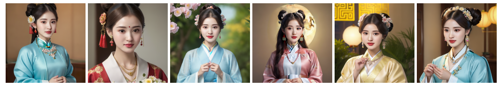
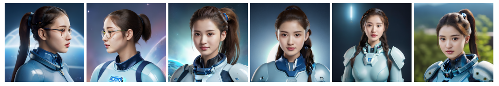
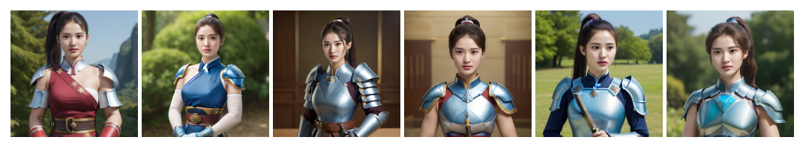

提供了 4 个兼容 MajicmixRealistic_v6 和 leosamsMoonfilm_filmGrain20 的风格模型：中秋(zhongqiu_dress)、原神旗袍风格(genshin_dress)、简易赛博朋克(cyberpunk)、新式铠甲风格(new_armor)

- 用于训练的人脸id

- 中秋(zhongqiu_dress)

- 原神旗袍风格(genshin_dress)

- 简易赛博朋克(cyberpunk)

- 新式铠甲风格(new_armor)

