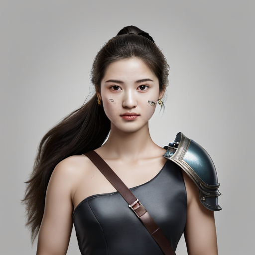

 提供了 3 个兼容 leosamsMoonfilm_filmGrain20 的风格模型：原神旗袍风格(genshin_dress)、简易赛博朋克(cyberpunk_lora)、新式铠甲风格(new_armor_lora)。
- 用于训练的人像

- 原神旗袍风格(genshin_dress)

- 简易赛博朋克(cyberpunk_lora)

- 新式铠甲风格(new_armor_lora)

